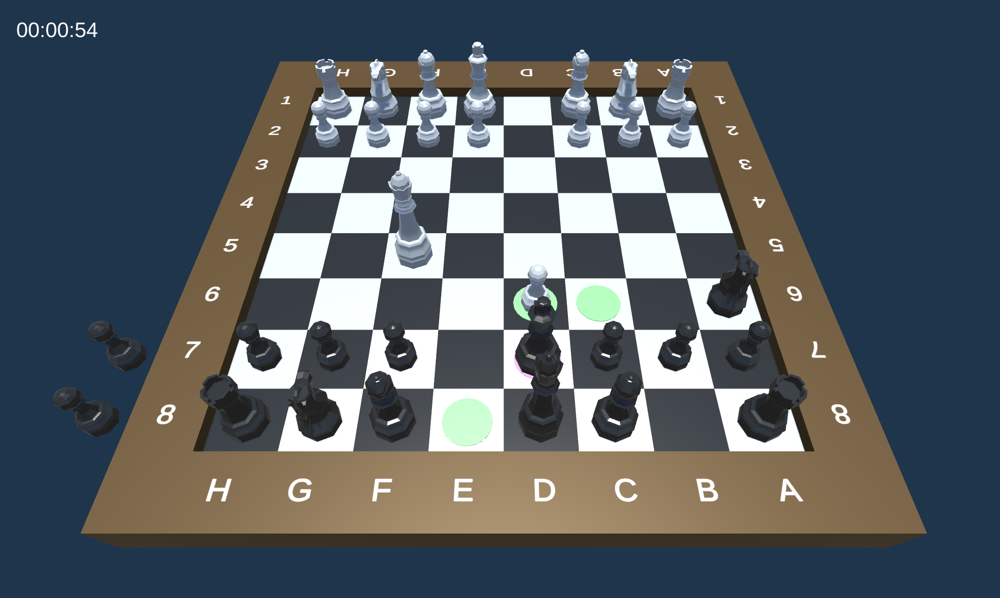

# Unity-Chess
This project serves as a showcase of my capabilities in Unity C# development, providing a full implementation of chess gameplay. It features the full set of chess rules, turn-based gameplay, move rules for all six types of chess pieces, and move validation to ensure compliance with game rules. Special moves such as castling, pawn promotion, and en passant are included, along with mechanics for capturing and the detection of game states including check, checkmate, and draw.

A straightforward user interface is integrated for game management, offering options to restart the game or exit, and selecting a specific piece for pawn promotion. The project utilizes Zenject for dependency injection, facilitating a structured and maintainable codebase.

The codebase is available for review, and contributions for improvement are welcome. Feel free to utilize parts of the code in other projects as needed.

# License

This project is open-sourced under the MIT License - see the [LICENSE.md](https://github.com/alexanderlarsen/Chess/blob/main/LICENSE) file for details.

# Third Party Assets

- "Low Poly Chess Board" (https://skfb.ly/TtYD) by Cyberleaf Studio is licensed under Creative Commons Attribution (http://creativecommons.org/licenses/by/4.0/).

- "Zenject" by Modest Tree is licensed under the [MIT License](https://github.com/alexanderlarsen/Chess/blob/main/Assets/Plugins/Zenject/LICENSE.txt).

To use these assets in your project, please follow the licensing terms and provide the required attributions.

# Contact

Get in touch at https://alexanderlarsen.com/contact 
